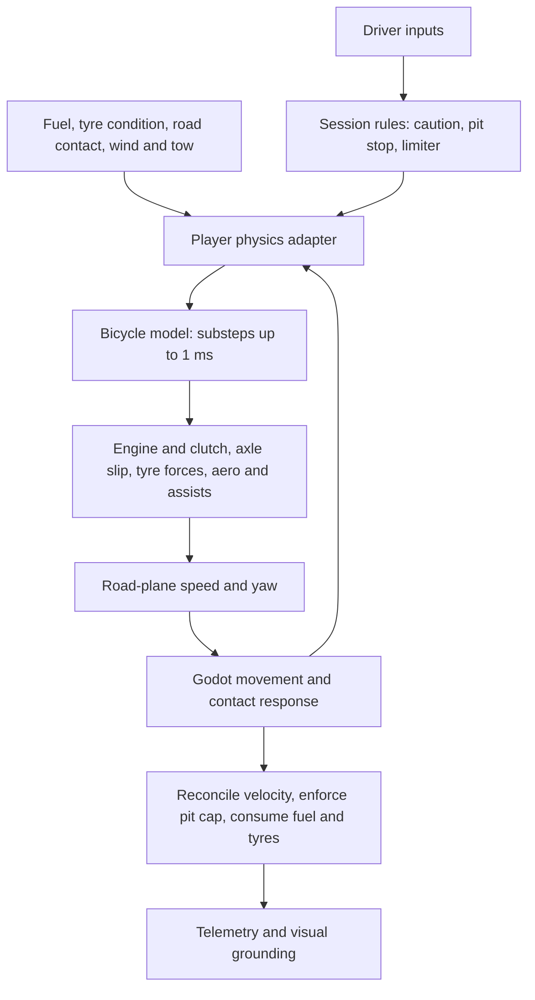

# Player car physics

Implementation overview, checked against the working tree on 30 September 2026.
This describes the current prototype; numerical tuning is not a validated
reconstruction of a particular IndyCar chassis, tyre or engine.

## Start here

The player uses a custom **dynamic bicycle (single-track) model**: one effective
front tyre and one effective rear tyre represent the two axles. Engine torque,
tyre slip, braking and aerodynamic forces determine motion along the road plane.
Godot's `CharacterBody3D` supplies movement, ground contact and collision queries.
The car is not driven by Godot's built-in `VehicleBody3D` wheel simulation.

Read this overview first, then use:

- [Model and equations](player_physics_model.md) for the simulation state, forces and update order.
- [Tuning reference](player_physics_tuning.md) for configuration, units and handling effects.
- [Aero](aero.md), [gearing](gearing.md), [slipstream](slipstream.md) and
  [tyre wear](tyre_wear.md) for detailed subsystem behaviour.
- [Car and wall contacts](car_contacts.md), [wheel controls](wheel_controls.md),
  [wheel visuals](wheel_visuals.md) and [audio](audio.md) for related systems.

## How a driving tick works



The internal substeps resolve the tyre/drivetrain model. Collision movement and
road sampling happen at the outer driving tick, not once per model substep.

## Code map

| Responsibility | Source |
| --- | --- |
| Player scene and controller selection | [player_vehicle.tscn](../content/vehicles/open_wheel/scenes/player_vehicle.tscn) |
| Inputs, road-plane conversion and simulation integration | [player_bicycle.gd](../game/vehicle/player_bicycle.gd), especially `drive_step()` |
| Force calculation and numerical integration | [bicycle_model.gd](../game/vehicle/bicycle_model.gd), `advance()`, `_integrate()`, `_tyre()` |
| Configuration loading and validation | [physics_config.gd](../game/vehicle/physics_config.gd) |
| Movement, ground support and contact response | [basic_car.gd](../game/vehicle/basic_car.gd) |
| Fuel, tyre condition and pit service | [player_state.gd](../game/vehicle/player_state.gd) |
| Wing/body coefficient calculation | [aero_model.gd](../game/vehicle/aero_model.gd) |
| Wake sampling | [slipstream.gd](../game/vehicle/slipstream.gd) |
| Recorded physics data | [telemetry.gd](../game/vehicle/telemetry.gd) |

AI controllers vary: bicycle-physics AI and reference-speed AI have separate
behaviour. See [AI physics](ai_physics.md) and [ICR2 method](icr2_method.md).
Do not assume a player tuning change affects every opponent in the same way.

## What is modelled

| System | Current behaviour |
| --- | --- |
| Tyres | Slip angle and slip ratio produce axle forces, capped by combined available grip. Grass and race tyre condition scale grip. |
| Weight and banking | Dry mass plus fuel; front/rear static distribution, approximate longitudinal load transfer, road gravity and turning load on banks. |
| Powertrain | Torque curve, engine and axle inertia, assisted friction clutch, six forward gears, neutral and reverse; rear-wheel drive. |
| Braking | Front/rear brake bias and axle brake torque; lock-up is possible with assists disabled. |
| Aero | Body package and wing angles determine drag, downforce and aero balance. Forces use air-relative speed. |
| Slipstream | A smoothed wake reduces drag by up to 9%; it does not directly reduce downforce. |
| Fuel | Distance-based consumption changes vehicle mass and scaled yaw inertia. Empty fuel removes throttle input. |
| Tyre wear | One condition value for the whole car, consumed during eligible race running; grip falls to 92% at fully worn condition. |
| Contacts | Horizontal car impulses and wall rebound/friction feed velocity back into the player model. |
| Assists | Steering restriction, yaw correction, sideslip damping and direct axle-speed intervention for traction/braking. |

Default assistance is strong and intended for keyboard accessibility. Setting
`assistance_strength=0` disables these handling interventions, but automatic clutch
assistance, base steering limits, pit/reverse caps and session rules still apply.

## Controls and diagnostics

| Input | Action |
| --- | --- |
| W / S | Throttle / brake; W also powers reverse |
| A / D | Progressive steering |
| Q / E | Shift down/up and select manual mode |
| M | Toggle automatic forward shifting |
| V | Select reverse / first, subject to the direction-change speed check |
| N | Select neutral; E returns from neutral to first |
| R | Reset to the assigned pit box |
| 8 | Physics diagnostics |
| F11 | Stop/resume player telemetry |

The player starts in first with automatic shifting. Shifts interrupt drive and
cannot stack during the shift interval; predicted over-rev shifts are rejected.
Wheel mapping is covered in [wheel controls](wheel_controls.md).

Player telemetry starts when a driving session loads and writes CSV plus setup
metadata under `user://telemetry`. Compare actual recorded settings: saved track
setups can override the authored wing and gear defaults. The diagnostics panel
shows slip, grip usage, loads, aero, tow and wall-impact information.

## Validation

These are existing checks to run after relevant changes, not a claim that they
passed on the date of this documentation update. From the project root, use your
Godot executable (replace `godot` if it is not on PATH):

```powershell
godot --headless --path . --script res://tools/validate_bicycle.gd
godot --headless --path . --script res://tools/validate_player_physics.gd
```

| Change | Relevant checks in `tools/` |
| --- | --- |
| Core forces, gears or integration | [validate_bicycle.gd](../tools/validate_bicycle.gd): includes combined grip, airborne traction and 60/120 Hz agreement |
| Track integration or ground support | [validate_player_physics.gd](../tools/validate_player_physics.gd), [validate_surface_reentry.gd](../tools/validate_surface_reentry.gd) |
| Handling assistance | [validate_stability.gd](../tools/validate_stability.gd) |
| Banking | [validate_texas_banking.gd](../tools/validate_texas_banking.gd), [validate_texas_surface_contacts.gd](../tools/validate_texas_surface_contacts.gd) |
| Shifting | [validate_gear_shifts.gd](../tools/validate_gear_shifts.gd) |
| Fuel or wear | [validate_fuel.gd](../tools/validate_fuel.gd), [validate_tyre_wear.gd](../tools/validate_tyre_wear.gd) |
| Tow | [validate_slipstream.gd](../tools/validate_slipstream.gd) |
| Collisions | [validate_car_contacts.gd](../tools/validate_car_contacts.gd), [validate_wall_contacts.gd](../tools/validate_wall_contacts.gd) |
| Recorded data | [validate_telemetry.gd](../tools/validate_telemetry.gd) |

For handling comparisons, hold track, fuel, tyre condition, wings, gearing, input
method and assists constant. Record clean-air runs separately from towing. Keep
measured speed/lap results with those conditions and the code revision rather
than treating an old test's top speed as a permanent specification.

## Current limitations

There is no independent four-wheel suspension, lateral left/right load transfer,
roll/pitch dynamics, detailed differential, tyre temperature or compound model.
Tyre forces use a simple capped stiffness model, not a calibrated Magic Formula
fit. Tyre wear and fuel burn are distance models rather than thermal/combustion
simulations. The idle helper prevents normal stalls; there is no clutch pedal.

Ground alignment is partly visual; the collider stays upright. Airborne motion
has gravity but no full rigid-body attitude simulation. Car contacts use an
equal-mass approximation, and impacts do not generate physical spin or structural
damage. Wall severity events provide inputs for future damage work.

## Keeping this guide current

Update the relevant chapter when changing a model equation, parameter meaning,
setup override or assistance rule. Keep subsystem detail in its linked document.
Record evidence separately from intended behaviour and provisional tuning.
